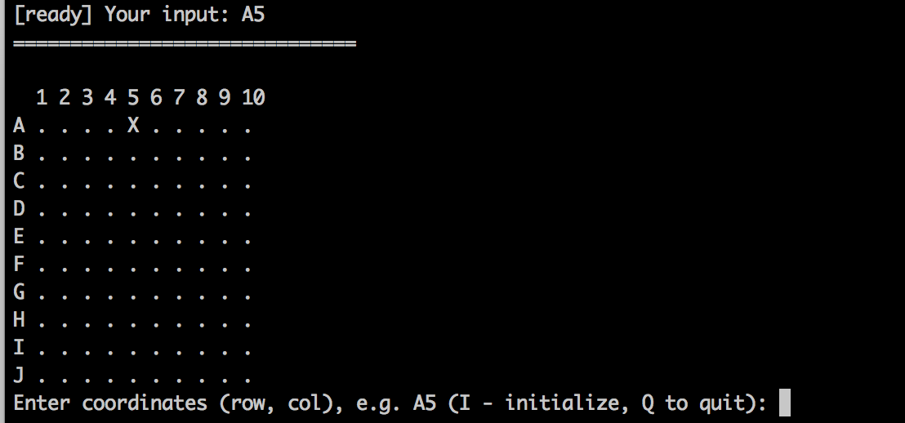
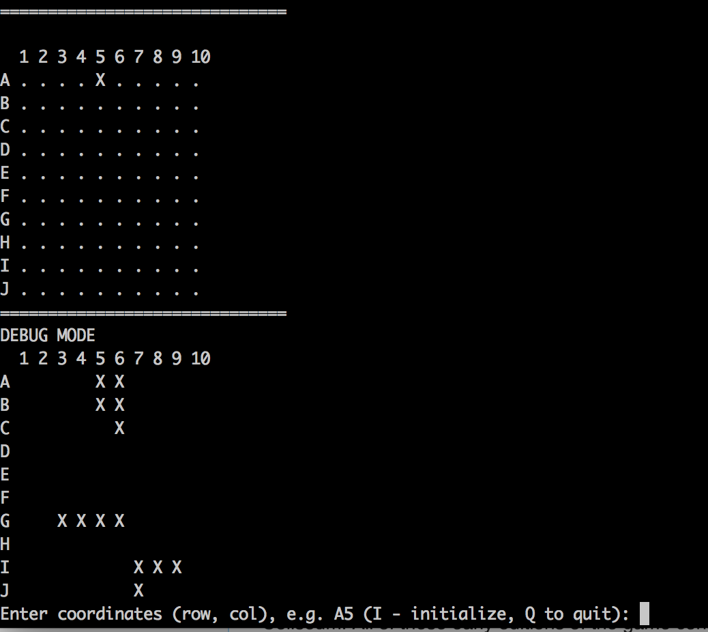

# Ruby Implementation of Battleship game

[](https://codeclimate.com/github/szymon33/battleship)
[](https://codeclimate.com/github/szymon33/battleship/coverage)

The Battleship is an application which implements [Battleship game](https://en.wikipedia.org/wiki/Battleship_(game)) Battleship game in Ruby language. This document contains implementation notes and gotcha's.

## Usage notes

You can use the game by the folloging file:

* [console.rb](lib/console.rb) - this is an example how to start interactive mode.

* You could test/play by yourself in interactive mode/console by typing

   ```ruby
   ruby console.rb
   ```
* There is a hdding command 'D' to enter debugg mode.

## Screenshots




